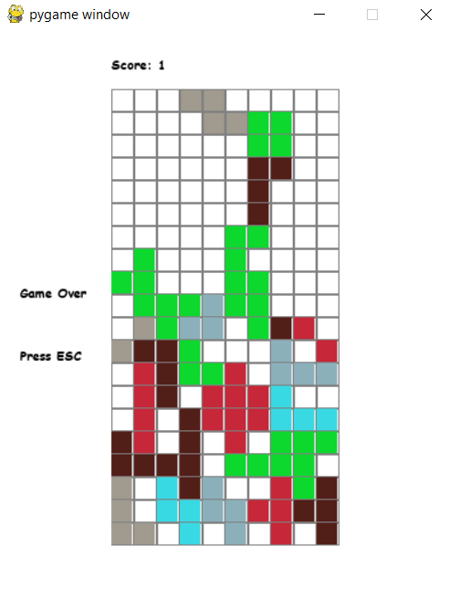

Tetris is a tile-matching arcade style video game which is widely held as one of the greatest early video games ever created. It's simplicity of rules and positive benefits on the human brain make it a great video to play. 

So let's build Tetris using Python, with the help of the Pygame library! This post is part 1 in a series of posts designed to help you make your own Tetris game in Python. 


<p align="center">Figure 1: Screenshot of the Tetris game we will build</p>

### What You Will Need
Before starting to code the Tetris game we must ensure that you meet these requirements before building anything:
* Python 3(preferably 3.8 or above) installed
* Pygame 2(preferably 2.0.1 or above) installed 
* Knowledge of the Tetris game rules([see here](https://www.interaction-design.org/literature/article/a-game-explained-an-example-of-a-single-game-and-how-it-meets-the-rules-of-fun#:~:text=as%20you%20can.-,Rules,blank%20space%20in%20a%20line.))
If you want to know how to install Pygame see installation instructions below. 

### How to install Python 3 
1. Open a terminal instance in your IDE's workspace 
2. Use the ```pip``` tool to install pygame using this command: ```python3 -m pip install -U pygame --user```
3. Done :grinning
 
### 1. Setup environment and game file 
First go to your IDE and create a folder for the Tetris game you are about to build. Then inside that folder, create a file called ```__main__.py```. This file will hold all the code needed to build this game. 

Let's start by importing the required libraries and defining some global variables. 
```
import pygame, sys, os, random 
from pygame.locals import *  


colors = [
    (37, 235, 11), 
    (160, 154, 143), 
    (139, 176, 186), 
    (57, 217, 227), 
    (82, 30, 24),
    (13, 216, 46),
    (198, 39, 57)
]

WHITE = (255, 255, 255)
GREY = (128, 128, 128)
BLACK = (0, 0, 0)

level = 1
lines_to_clear = 1
```
We need the ```pygame``` library and the ```pygame.locals``` library so we'll import those. The ```colors``` array contains all the colors that any of the figures in the Tetris game will contain. The colors are stored in RGB format. The ```WHITE, GREY, BLACK``` colors will be used to color various sections of the game screen such as background, grid and text color. Now, the ```level``` global variable keeps track of the current level of the game, starting from 1. And lastly, the ```lines_to_clear``` variable keeps track of how many lines to clear in order to move to the next level. Ex: if you're in level 2, you'll have to clear 2 lines in order to play level 3. 

### 2. Setup classes and main() 

For this Tetris implementation we'll need two classes: Figure and Tetris. Figure is the class that all objects that fall from the top of the screen are instances of, also known as the Model in MVC Pattern terminology. The Tetris class is the Controller in MVC terminology because it holds the state of the game, controls game flow and separates the view from the model(which is the Figure class in this case). 

Now let's define the Figure class first:
```
class Figure:
    '''
    Figure class is used to create the blocks that will fall down from the top of the screen 
    |0 |1 |2 |3 |
    |4 |5 |6 |7 |
    |8 |9 |10|11|
    |12|13|14|15|
    This is a visual of the 4x4 grid system used 
    to rotation the various shapes in Tetris game.

    Tetromino: is a geometric shape composed of 4 squares 
    '''
    figures = [
        [[4, 5, 6, 7], [1, 5, 9, 13]], # for straight line
        [[1, 4, 5, 6], [1, 4, 5, 9], [4, 5, 6, 9], [1, 5, 6, 9]], # for pyramid tetromino
        [[1, 2, 5, 9], [0, 4, 5, 6], [1, 5, 8, 9], [4, 5, 6, 10]], # for left side L-shaped tetromino 
        [[1, 2, 6, 10], [3, 5, 6, 7], [2, 6, 10, 11], [5, 6, 7, 9]], # for right side L-shaped tetromino 
        [[5, 6, 9, 10]], # for square shape 
        [[1, 2, 4, 5], [0, 4, 5, 9], [5, 6, 8, 9], [1, 5, 6, 10]], # for left side zig-zag shaped tetromino 
        [[1, 2, 6, 7], [3, 6, 7, 10], [5, 6, 10, 11], [2, 5, 6, 9]] # for right side zig-zag shaped tetromino 
    ]

    def __init__(self, x, y):
        self.x = x 
        self.y = y 
        self.type = random.randint(0, (len(self.figures) - 1))
        self.color = random.randint(1, (len(colors) - 1))
        self.rotation = 0 

    # gets the specific shape and color of currently falling object 
    def get_image(self):
        return self.figures[self.type][self.rotation]

    # increments to the next rotation of any type of figure
    def rotate(self):
        self.rotation = (self.rotation + 1) % (len(self.figures[self.type])) 
```
I will explain each of the attributes and methods in Figure class below:
* ```figures``` array: This is a multidimensional array used to store all the figure shapes along with their respective rotations. The way this works is that all figures all stored in a 4x4 matrix like this:

<div class="tetris_4x4_grid_shape_section">


<p align="center">Shape #1</p>


<p align="center">Shape #2</p>


<p align="center">Shape #3</p>


<p align="center">Shape #4</p>


<p align="center">Shape #5</p>

</div>
Then, each list inside ```figures``` contains all the specific rotation coordinates for that particular shape. For example Shape #1's second rotation looks like this: 


* ```def __init__(self, x, y)```: in this Figure constructor we get the x and y starting coordinates for each Figure instance from the constructor parameters. The ```self.type``` attribute assigns a shape from the ```figures``` array to each Figure instance, which will be determined randomly. The ```self.color``` attribute randomly assigns a color from the ```colors``` global array to each Figure instance. Finally, the ```rotation``` attribute assigns the first rotation of each shape and keeps track of the rotations of each shape, to every Figure. 

* ```def get_image(self)```: this method randomly determines a shape type and color combination for each Figure instantiation and returns that array of specific coordinates. 

* ```def rotate(self)```: this method is used for incrementing to the next rotation of each shape. The logic inside ensures that no array indexing errors occur and that after the final rotation, the first rotation is used again, effectively looping the rotations of each shape.

Now let's build the Tetris class:
```
class Tetris:
    lines_cleared = 0
    score = 0 
    state = "start"
    field = [] 
    HEIGHT = 0
    WIDTH = 0 
    startX = 100 
    startY = 50
    zoom = 20 
    figure = None 

    def __init__(self, height, width):
        self.field = []  
        self.figure = None 
        self.height = height 
        self.width = width
        for i in range(height):
            new_line = []
            for j in range(width):
                new_line.append(0)
            self.field.append(new_line)     
```
Here is the explanation for each attribute and the constructor in Tetris:
* ```lines_cleared```: This variable keeps track of how many lines were cleared when a Figure fixes on to the bottom of the game screen. It is used to keep track of when to level up
* ```score```: keeps track of the score in-game 
* ```state```: keeps track of the state of the game, starting with ```start``` then changes to ```gameover``` if the game over conditions are met(which are if the shapes touch the top of the game screen)
* ```field```: this is a multi-dimensional array which keeps track of each tile in the game screen. The default size is 10x20, so the total number of tiles in the game screen is 200. Each tile is given value of ```0``` to denote an empty tile and as the game progresses the tiles are given a non-zero value once a Figure lands on that tile. 
* ```startX```: this is the starting x coordinate from where each figure will fall from. Note: the value is based on the window screen, not the game screen(which is smaller in size)
* ```startY```: this is the starting y coordination from where each figure will fall from. Also based on window size
* ```zoom```: this attribute helps in filling each game tile with color when a Figure is occupying it or falling through that tile. 
* ```figure```: this is what holds the current Figure instance, so that the Figure instance can be controlled by the Tetris instance
* ```def __init__(self, height, width)```: constructor for Tetris, assigns the passed height and width to the Tetris instance. Since the Tetris class will be instantiated more than once upon leveling up in-game, the ```field = []``` and ```figure = None``` lines erases the data from the previous level. Finally, the constructor fills the ```field``` multi-dimensional array with ```0``` values as a starting point for the game

Now let's add the methods for the Tetris class:
```
    def create_figure(self):
            self.figure = Figure(3, 0)
 
    def intersects(self):
        intersects = False 
        for i in range(4):
            for j in range(4):
                if (i * 4) + j in self.figure.get_image():
                    if (i + self.figure.y) > (self.height - 1) or \
                        (j + self.figure.x) > (self.width - 1) or \
                        (j + self.figure.x) < 0 or \
                        self.field[i + self.figure.y][j + self.figure.x] > 0:
                        intersects = True 
        return intersects 

    def freeze_figure(self):
        for i in range(4):
            for j in range(4):
                if i * 4 + j in self.figure.get_image():
                    self.field[i + self.figure.y][j + self.figure.x] = self.figure.color        
        self.break_lines()
        self.create_figure()
        if self.intersects():
            self.state = "gameover"      

    def break_lines(self):
        lines = 0 
        for i in range(1, self.height):
            zeros = 0 
            for j in range(0, self.width):
                if self.field[i][j] == 0:
                    zeros += 1
                
            if zeros == 0:
                lines += 1
                for i1 in range(i, 1, -1):
                    for j in range(self.width):
                        self.field[i1][j] = self.field[i1 - 1][j]        
        self.score += lines ** 2
        self.lines_cleared += lines 
        self.check_level_up() 
    
    def check_level_up(self):
        global level 
        global lines_to_clear 
        if self.lines_cleared >= level:
            level += 1
            lines_to_clear = level 
            self.lines_cleared = 0 
            return True 
        else:
            lines_to_clear = level - self.lines_cleared 
            return False 

    def go_space(self):
        while not self.intersects():
            self.figure.y += 1
        self.figure.y -= 1 
        self.freeze_figure()

    def go_down(self):
        self.figure.y += 1
        if self.intersects():
            self.figure.y -= 1
            self.freeze_figure()

    def go_sideways(self, dx):
        previous_x = self.figure.x 
        self.figure.x += dx  
        if self.intersects():
            self.figure.x = previous_x  

    def rotate(self):
        previous_rotation = self.figure.rotation
        self.figure.rotate()
        if self.intersects():
            self.figure.rotation = previous_rotation 
```
Explanation:
* ```def create_figure(self)```: This method creates a new Figure instance and assigns it to the figure attribute in Tetris

* ```def intersects(self)```: This method checks if the currently falling Figure is colliding with any fixed Figures at the bottom of the game screen and/or if the falling Figure is trying to go out of bounds in the x axis. It returns True if either of these conditions occurs and False if neither occurs

* ```def freeze_figure(self)```: This method is used for freezing the falling Figure to the game screen if it is found to be colliding with the game screen bottom or any of the fixed figures. After freezing, it checks if any of the lines(rows in the game screen) are full by calling ```break_lines()``` and then creating a new Figure instance by calling ```create_figure()```. Finally, it checks if the newly created Figure collides with the structure of fixed figures immediately upon creation, in order to sense if the game should be over, and if it is then it sets the game state to ```gameover``` thereby ending the game

* ```def break_lines(self)```: Main purpose of this method is to check if any of the rows in the game screen, also known as lines, are completely filled with Figures. If so then it take that row's most immediate top row and replaces it's own row with that top row, which effectively deletes completely full rows, pushes down incomplete rows and increments the score for each row that was deleted. As a bonus if multiple rows are deleted at once then twice the normal amount of points are awarded. Finally, it adds the amount of lines cleared to ```lines_cleared``` and calls ```check_level_up()``` in order to check if the next level can be reached

* ```def check_level_up(self)```: The method that checks if the next level can be achieved is this one. If the required amount of lines were cleared then it returns ```True```. If not, then it calculates the amount of lines needed to be cleared and assigns that value to the ```lines_to_clear``` global variable 

* ```def go_space(self)```: If the ```down``` arrow key is held then this method makes the currently falling Figure travel at a much faster speed until the ```down``` arrow is released or when it collides with a fixed figure at which point that Figure is frozen via ```freeze_figure()```. Note: the event listeners for the ```down`` arrow key are located in the main() method

* ```def go_down(self)```: Similar to ```go_space()``` except that this method only makes the current Figure fall at a rate of one tile per method call. 

* ```def go_sideways(self, dx)```: This method makes the current Figure move to the sides when called. The ```dx``` parameter controls which direction to go, ```1``` for right side and ```-1``` for left side. Note: the direction will be supplied from ```main()```

* ```def rotate(self)```: Serves to rotate the current Figure when called. If the next rotation collides with a fixed figure on game screen then it reverts back to the original rotation. 

In the next post I will cover the implementation of the ```main()``` function along with other details. Stay tuned and thanks for reading my blog post!

### Closing Notes 
Well that's all for today, I hope you found this tutorial helpful. I would greatly appreciate if you could check out my [Youtube channel](https://www.youtube.com/channel/UCtxed_NljgtAXrQMMdLvhrQ?), [LinkedIn](https://www.linkedin.com/in/shehan-a-780622126/) and [Github](https://github.com/ShehanAT).
