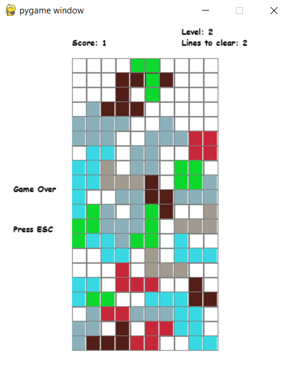

This post is part 2 of the "How to build a Tetris game in Python using Pygame" series. It will cover the implementation of the ```main()``` method and some other additional details. 

By the end of this article you should have a fully functioning Tetris game so let's dive in :white_check_mark:

<p align="center">Figure 1: Screenshot of the Tetris game we will build</p>
 

### Main() function
Let's begin building our ```main()``` function by adding the game variables and Pygame initialization methods first:
```
def main():
    global level 
    global lines_to_clear 
    screen_height = 400 
    screen_width = 500
    game_height = 20 
    game_width = 10 
    pressing_down = False 
    gameover = False 
    counter = 0 
    fps = 30 

    pygame.init()
    window = pygame.display.set_mode((screen_height, screen_width))
    clock = pygame.time.Clock()
    game = Tetris(game_height, game_width)
```
Here is the explanation for these lines of code: 
* ```global level``` & ```global lines_to_clear```: these variables control the leveling system in the game, with ```level``` controlling current level and ```lines_to_clear``` keeping track of how many lines to clear in order to reach the next level. The ```global``` keyword is used in order to allow access to global variables, inside methods 

* ```screen_height``` & ```screen_width```: Quite self explanatory, this sets the window dimensions of the game. Note: The window size is not the size of the game screen, which will be smaller 

* ```game_height``` & ```game_width```:
These variables set the game height and width. Since it is 20 tiles in height and 10 tiles in width, there will be 200 available game tiles for use

* ```pressing_down```: This boolean is used to identify when the ```DOWN``` arrow key is held in order to know the duration for how long a Figure should quickly drop from the top of the game screen(with the fast drop being handled by the Tetris class's ```go_space()``` method)

* ```gameover```: Primarily used as an indicator of when the game should be over

* ```counter``` & ```fps```: work together to control the game clock which is tells the falling Figure objects the speed at which to fall 

* ```pygame.init()```: This tells Pygame to start initialization of all imported pygame modules

* ```window```: is the variable holding the Pygame window for the entire game 

* ```clock```: is the game clock, used to set falling Figure speed

* ```game```: is the Tetris instance stored in the ```main``` method

Now let's add the main ```while``` loop in ```main()```:
```
while not gameover:
        if game.figure is None:
            game.create_figure()
        counter += 1 
        if counter > 100000:
            counter = 0 

        if counter % (fps // level // 2) == 0 or pressing_down:
            if game.state == "start":
                game.go_down()
        
        for event in pygame.event.get():
            if event.type == pygame.QUIT:
                gameover = True
                pygame.quit()       
            if event.type == pygame.KEYDOWN:
                if event.key == pygame.K_RIGHT:
                    game.go_sideways(1)
                if event.key == pygame.K_LEFT:
                    game.go_sideways(-1)
                if event.key == pygame.K_UP:
                    game.rotate()
                if event.key == pygame.K_DOWN:
                    pressing_down = True 
                if event.key == pygame.K_SPACE:
                    game.go_space()
                if event.key == pygame.K_ESCAPE:
                    pygame.quit()
                    sys.exit(0)

        if event.type == pygame.KEYUP:  
            if event.key == pygame.K_DOWN:
                pressing_down = False 
        
        window.fill(WHITE)

        for i in range(game.height):
            for j in range(game.width):
                pygame.draw.rect(window, GREY, [game.startX + game.zoom * j, game.startY + game.zoom * i, game.zoom, game.zoom], 1) 
                if game.field[i][j] > 0:
                    pygame.draw.rect(window, colors[game.field[i][j]], 
                        [game.startX + game.zoom * j, game.startY + game.zoom * i, game.zoom - 2, game.zoom - 1])
    
        if game.figure is not None:
            for i in range(4):
                for j in range(4):
                    p = i * 4 + j
                    if p in game.figure.get_image():
                        pygame.draw.rect(window, colors[game.figure.color],
                                        [
                                            game.startX + game.zoom * (j + game.figure.x) + 1,
                                            game.startY + game.zoom * (i + game.figure.y) + 1,
                                            game.zoom -2, 
                                            game.zoom - 2
                                        ])

        font2 = pygame.font.SysFont('Consolas', 11, bold=True)
        font1 = pygame.font.SysFont('Comic Sans MS', 11, bold=True)
        text_score = font1.render("Score: " + str(game.score), True, BLACK)
        text_level = font1.render("Level: " + str(level), True, BLACK)
        text_lines_to_clear = font1.render("Lines to clear: " + str(lines_to_clear), True, BLACK)
        text_game_over1 = font1.render("Game Over", True, BLACK)
        text_game_over2 = font1.render("Press ESC", True, BLACK)
        
        window.blit(text_score, [100, 20]) 
        window.blit(text_lines_to_clear, [250, 20])
        window.blit(text_level, [250, 5])
        if game.check_level_up():
            main()
        if game.state == "gameover":
            window.blit(text_game_over1, [20, 220])
            window.blit(text_game_over2, [20, 275])
        pygame.display.flip()
        clock.tick(fps) 
```
For the sake of keeping this post short I will summarize what this code does below:
1. Create a new Figure instance if none is already created 
2. Setup game clock logic for controlling the speed at which the Figure falls from the top of the screen 
3. Setup event listeners for responding to the arrow keys for moving the Figure, ```SPACE``` for fast dropping the Figure and the ```ESC``` for quitting the game
4. Create event listener responsible for fast dropping the current Figure when the ```DOWN``` arrow key is held
5. Draw the grey grid outline on the Pygame main window 
6. Draw the currently falling Figure on the grey grid outline 
7. Set and position the font for the display text for game score, current level and lines to clear
8. Check if game can level up, if so do so, if not proceed to step 9
9. Check if the game is over, if so display the game over text, if not proceed to step 10 
10. Continuously update the contents of the screen via ```pygame.display.flip()```, then ```clock.tick(fps)``` for computing the amount of time elapsed since it's previous call 

Finally outside of the ```main``` method we need a way to call the ```main``` method upon running the program so we include these lines of code at the bottom of the file:
```
if __name__ == "__main__":
    main()
```
### Final Steps
Whew! :cold_sweat: if you managed to make it this far, congratulations! You should have a fully functional Tetris game by now but just in case you need additional reference [click here](https://gist.github.com/ShehanAT/1d15a3e38032bced1938c19adaf8db51) to view the complete game file on Github Gist. 

Thanks for reading my blog post! :simple_smile:
### Closing Notes 
Well that's all for today, I hope you found this tutorial helpful. I would greatly appreciate if you could check out my [Youtube channel](https://www.youtube.com/channel/UCtxed_NljgtAXrQMMdLvhrQ?), follow me on [Twitter](https://twitter.com/Shehan_Atuk), [LinkedIn](https://www.linkedin.com/in/shehan-a-780622126/) and [Github](https://github.com/ShehanAT) 
