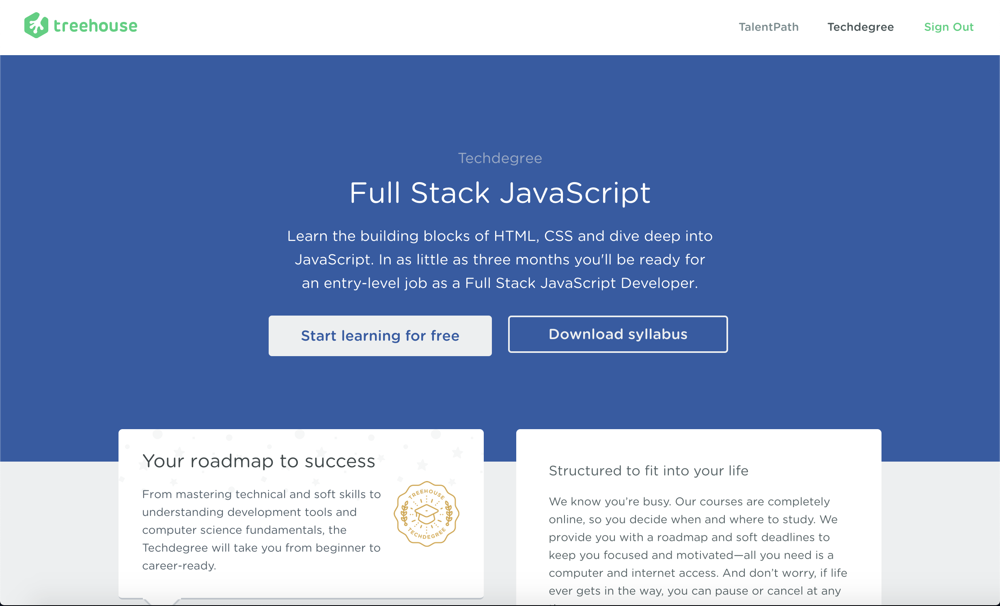

Welcome to my first post of 2019! It's been a while since my last post, been busy working on the Fullstack Javascript Techdegree from TeamTreehouse. I recently finish this program and feel it's time for a review of my experience with it. So here we go!

What is the Fullstack Javascript Techdegree?

* The program mainly revolves around build 12 real world applications using technologies such as HTML, CSS, Javascript, React, MongoDB, and SQL.
* The rest of the program consists of taking online video courses. These video courses, usually 120 minutes of content, follow the pattern of: introduce new technologies/practice, build a sample application integrating the new technologies/practice, and finally take quizzes and fill-in-the-blanks exercises based on the new concept.
* At the end an exam will test your knowledge on all the technologies, practices and computer science fundamentals taught in the program and upon completion a certificate of completion will be awarded to you on [accredible.com.](https://www.accredible.com/)

Personal Review:

Overview its a good program but the cost of $200 per month does not fully outweigh the benefits. It would have nice if they made it so all 12 projects could be hosted on Heroku or some other static site content provider as I feel having a live demo of the projects you have built is a huge plus for displaying them in a portfolio. This is because recruiters typically don't have the time or patience to go through the tedious process of setting up your projects. Instead live demos are an easier way for job recruiters to check out the projects built in this program.

Because of the high price tag I often felt the need to rush through the course material in order to finish the program faster. Although I did finish the program in 4 months, which is a month earlier than the estimated time to finish, I felt I would have learned a lot more had I been more focused on understanding the content. So the high price does not create the ideal environment that conducive to learning, especially if you're on a tight budget like I was.

Overall it's a good program just don't expect magic. Are there better resources out there that are completely free? Of course. Ultimately the 12 projects are the best value to be taken from this program because you can include these projects in your portfolio.

Thank you for reading this post! Feel free to follow me on Twitter [@ShehanAtuk](https://twitter.com/Shehan_Atuk),[Github](https://github.com/ShehanAT), and check out my [youtube channel](https://www.youtube.com/channel/UCtxed_NljgtAXrQMMdLvhrQ) for web development tutorials.