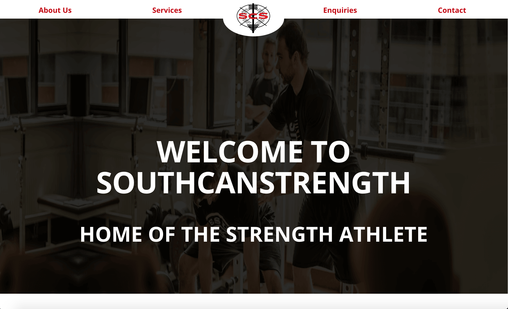

Hey everyone,

I just complete the first draft for a strength coaching services company South Can Strength. The site was built using a static site generator called Jekyll and uses Github Pages for static content hosting. You can find it [here](https://shehanat.github.io/southCanStrengthWebsite).

I took a much more methodical approach for the planning phase of this project that I will list below. First I asked the client tons of questions on what they were looking for in the website, i.e how many pages? what should the header layout be? how about the about us section?. I took note of the clients requirements first, something I believe is very important before starting to build anything.

Then I used a software called Affinity Designer(can't afford Photoshop lol) to design a in-depth template of the website, with layout, pictures , text and all. The whole process of making the template took around 2 days, which in hindsight is not too long at all specially considering the added benefit of having greater direction and foresight when it comes to the development process i.e coding the website. Also I should add that I made a template for each page, this website consists of a main page and contact me page so two templates were made.

Now the time came to code the website! First I code the html files. To do this I put the template beside my code editor, then visually break the layout of each page into sections i.e header section , about section,  services section. Then make separate html files for each section. Now I go into each section and break down the section layout into mental "div blocks", as I like to call them. Basically drawing imaginary boxes around the important parts of the layout. After that, those mental "div blocks" are actualize into actual div blocks in my html files.

With the structure, or skeleton if you will, of the website finished it is time for the all important CSS! I used a desktop first approach, meaning I wrote CSS specifically catered to the desktop version of the site. I feel going from desktop to mobile is better suited for beginners as myself. After the desktop CSS is done I wrote media queries for the mobile version. Turned out the navbar was acting weird on mobile so I had to used a separate navbar specifically for mobile and hide the desktop navbar when in mobile mode and visa versa. All in all the development process took a week which was actually quicker than I expected, I was expecting maybe two.

I will making constant improvements to the website, all based on the needs of the client. Ultimately I'm here to serve the client and that's what is most important in the life of a freelance web developer.

Thanks for reading my post, I really appreciate it. Check out [my youtube channel](https://www.youtube.com/channel/UCtxed_NljgtAXrQMMdLvhrQ), [my Twitter](https://twitter.com/Shehan_Atuk), and my Github [here](https://github.com/ShehanAT).

