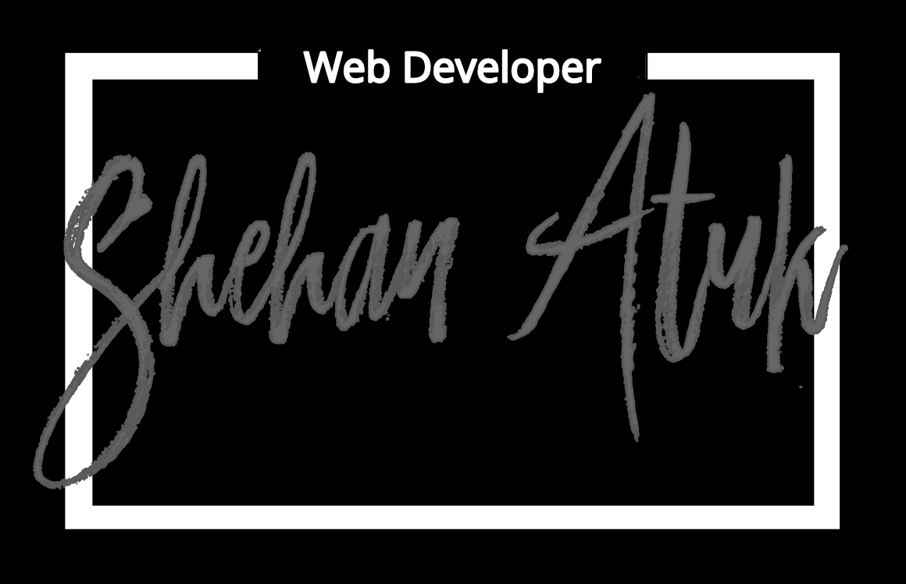

Hey everybody!

This is going to be a short tutorial on how to create a logo like this:

First you will need:
* A vector graphics editing software(eg. PhotoShop, Affinity Designer...)
* Computer 
* Your Mind :simple_smile:

To make this logo I used Affinity Designer, but you can follow along using any vector editting software of your choice(i.e: Photoshop) So let's get to the details:

* Create a new layer and attach a pixel layer to it(or its equivalent if you’re not using Affinity Designer)
* Pick the flood full tool and give the layer a black color
* Select the rectangle tool and draw two rectangles cantered on the document. Note: the first should be larger than the second one and should be enclosing the smaller one. Use something along the lines of a 1:0.8 ratio when choosing the size of the two shapes.
* Select and give in the inner rectangle a color matching the document background by creating a pixel layer on top of it and using the flood tool.
* Find and use a brush font of your choice to make the main lettering of the logo. I used Painter from dafont.com. Browse and try different fonts until you find the one you like.
* Back in your graphics editing application, select the text tool and type out your logo heading(in my case my full name) in the font chosen from the previous step.
* Centre the heading inside the inner rectangle.
* Mark out an evenly spaced rectangle section in the top part of the bigger rectangle then use the paint brush tool, pick the same color as the document background and paint over the marked out section.
* Finally select the text tool, pick a traditional font( or something different if you’re feeling fancy), type out your tag line and centre it inside the section we painted over in the previous step.
There you go the hard parts are done and I will leave you off here. Feel free to customize the size proportions, font types and colors till your heart’s desire. 

@ me your designs at @ShehanAtuk on Twitter, and check out my YouTube channel, Github and Codepen.