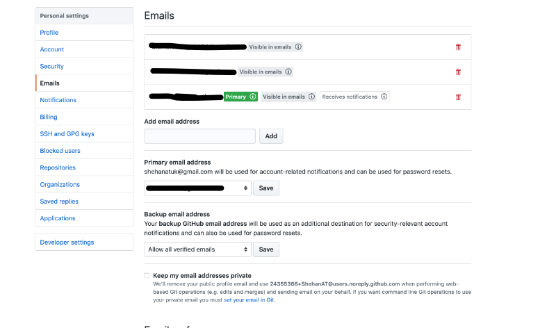

Hello everyone,

I recently realized that my local changes to git repos weren't showing up as contributions on my Github profile page. This puzzled me to say the least so I decided to look into the matter. 

Eventually I found [this article](https://help.github.com/en/articles/setting-your-commit-email-address), where it goes into detail about setup your email on Github. This solved my problem so I decided to share my solution to help anyone in need. Here we go:
1. navigate to the terminal and type ```git config --global user.email "email@example.com"``` where email@example.com would be the primary email associated with your Github account. 
2. now type ```git config --global user.email``` and you should see the email you just entered.
3. Then go to github.com, click on ```settings``` in the top-right navbar, select ```emails``` and you should see a page like this:

4. now add the same email you used in step 1, then scroll down to the ```primary email address``` section and pick the email just entered.
5. Make a test commit and push to your remote repo and the commit should show up in the commit history and count toward your contributions.

Well that's all for today, I hope you found this guide helpful. I would greatly appreciate if you could check out my [Youtube channel](https://www.youtube.com/channel/UCtxed_NljgtAXrQMMdLvhrQ?), follow me on [Twitter](https://twitter.com/Shehan_Atuk), [LinkedIn](https://www.linkedin.com/in/shehan-a-780622126/), [Github](https://github.com/ShehanAT) and [Instagram](https://www.instagram.com/shehanthewebdev/).
