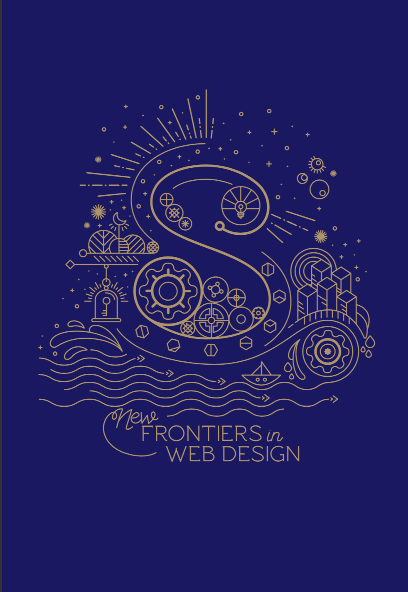

Hello everyone,

I just finished Smashing Book 6 by Smashing Magazine and here is the book review:

What is the Smashing Book 6?
Smashing Book 6 is the latest installment of the Smashing Book series by Smashing Magazine. Initially released in the September of 2018, the book covers major topics in Front end development and UX design in a fun and intuitive way. 

Personal Review of Smashing Book 6:
Overall I loved this book for the main reason of making me aware of bot frameworks. Prior to reading this bots were something mysterious and elusive in my eyes, but after reading chapter 8 I realized making bots are way more accesible and doable that previously imagined though the use of bot frameworks offered by Microsoft, such as the LUIS framework,  Amazon, such as Alexa, and many others. 

Chapter 9, a chapter on designing user experiences using augument/virtual/mixed reality technology, is also very interesting is that it opens up your mind to what is possible given the current technology and what the future holds, in terms of AR/VR/XR technology development. Traditional web and mobile interface driven applications can be improved upon by adding AR/VR/XR as viable means of interaction. 

Finally the chapter on Grid and Flexbox enlightened me in that I truly grasped the differences, similaries and various tips and tricks surrounding Grid and Flexbox. One notable thing I learned is that Grid layout accounts for two dimentions, columns and rows, whereas Flexbox concerns itself with only the column aspect of positioning. After reading the chapter pertaining to Grid and Flexbox I have switching from my old way of positioning elements, using ```position: block``` and ```position:inline``` to a style which heavily relies upon Grid and Flexbox layouts. For example I almost always used ```grid-template-columns``` as my goto for structuring columns, and ```flex: 1```  for its simplicity and elegance. 

So in conclusion, I loved reading this book mainly for the in-depth and practical knowledge provided on bot developement, augemented/mixed/virtual reality development and positioning with CSS Grid and Flexbox layouts. I am looking forward to the next iteration of this series and I recommend this book to any serious designer/developer. 

Well that's all for today, I hope you found this guide helpfull. I would greatly appreciate if you could check out my [Youtube channel](https://www.youtube.com/channel/UCtxed_NljgtAXrQMMdLvhrQ?), follow me on [Twitter](https://twitter.com/Shehan_Atuk), [LinkedIn](https://www.linkedin.com/in/shehan-a-780622126/), [Github](https://github.com/ShehanAT) and [Instagram](https://www.instagram.com/shehanthewebdev/).
