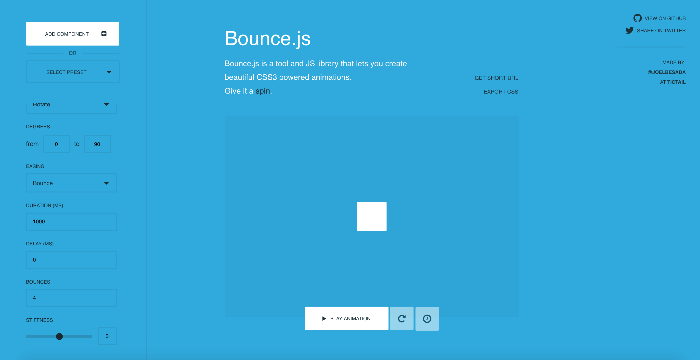

Hello everyone,

Today I'm going to show you how to use Bounce.js to add marlavous animations to your projects. First off: go to bouncejs.com and familirize yourself to their interface. It is pretty self exaplanatory and easy to use. The panel to the left lists all the animation types at your disposal. Follow this list to help you in your search:
* Button pop-out/shrink animation: for this you would select ```Add Component```, for type: ```Scale```. Then pick a decreasing width(i.e from 1 to 0.8) if you want a shrink animation, or a increasing width(i.e from 1 to 1.5) if you want a expanding animation. 
* Component sliding: for this pick type ```Translate``` and pick the starting and finishing coordinates for the x and y axes.  Keep in mind a value of zero is the dead centre of the screen.
* Rotating object: for type pick ```Rotate``` then specify the starting and ending degree extent. 

I will stop here for the sake of brevity but feel free to explore furthur. Also keep in mind the bottom panels contain some additional animations to make deliver a consistently smooth experience such as the adding stiff or loose animation to the ending state. 

Once you've selected your desired animations just click ```Export CSS``` button to the top-right of the main animation panel and it should pop-up a modal containing all the neccessary CSS to make your animations work. Copy all of it, navigate to your project and include it in your CSS files, preferably at the end as a good convention. 

Well that's all for today, I hope you found this guide helpful. I would greatly appreciate if you could check out my [Youtube channel](https://www.youtube.com/channel/UCtxed_NljgtAXrQMMdLvhrQ?), follow me on [Twitter](https://twitter.com/Shehan_Atuk), [LinkedIn](https://www.linkedin.com/in/shehan-a-780622126/), [Github](https://github.com/ShehanAT) and [Instagram](https://www.instagram.com/shehanthewebdev/).
