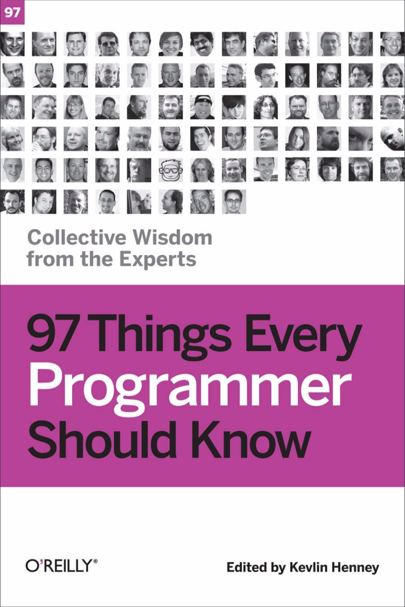

Hello everyone,

I just finished 97 Things Every Programmer Should Know. Here is my personal review on it: 

What is 97 Things Every Programmer Should Know about?
This book is a collection of short articles written by over 70 different authors, 73 to be exact, pertaining to industry best practices in the field of computer programming. Written in 2010 and published by O'Reilly publishing the book contains articles from many prolific figures in the field of software development  such as Uncle Bob aka Robert C. Martin, Kevlin Henney and Randy Stafford. 

Personal Review of Smashing Book 6:
The defining feature of this book is the short, concise and imformative articles it provides and it is one I truly enjoy. Since each author has only has two pages to convey their message they put effort into getting straight to the main idea without beating around the bush like so many other books on software development/design. I also like the emphasis placed on testing software before making production builds. 

An area of strong emphasis in this book the importance of testing, whether that be unit testing, integration testing, system testing, sanity testing or interface testing. I can safely estimate that over half the articles in the book are on some form of testing, which really shocked me because prior to reading this book I was unaware of the importance of  testing.

Although I've done some basic unit testing with Mocha and Chai for some JavaScript application in the past, I've never standardized testing in my usual way of software development. I usually develop applications in a development environment then push to production as soon as possible without testing of any sort. Reading this book changed my ways of software development in that I always implement testing of some sort prior to pushing to production. Whether that be unit testing with a framework such as Mocha, Jest, or Karma or simply letting my colleagues test the applications I develop and asking for feedback, reading this book made me develop and integrate the habit of testing into my software development tool belt. 

Other topics this book covers include how to use version control to better manage your software, importance of communication in the field of software development, and pair programming as an effective alternative to traditional 'lone wolf' programming. The articles on maintaining and developing good communication with co-workers, clients and bosses really resonated with me as I have a tendency to just code way without communicating with those whom I serve. 

Overall this is a must read book for new software developers because it teaches you that to be a great software developer is more than just coding away in your basement, but rather the implementation and development of best practices listed in this book and the ability to effectively communicate your intentions and ideas with those around you. 

Well that's all for today, I hope you found this guide helpfull. I would greatly appreciate if you could check out my [Youtube channel](https://www.youtube.com/channel/UCtxed_NljgtAXrQMMdLvhrQ?), follow me on [Twitter](https://twitter.com/Shehan_Atuk), [LinkedIn](https://www.linkedin.com/in/shehan-a-780622126/), [Github](https://github.com/ShehanAT) and [Instagram](https://www.instagram.com/shehanthewebdev/).
