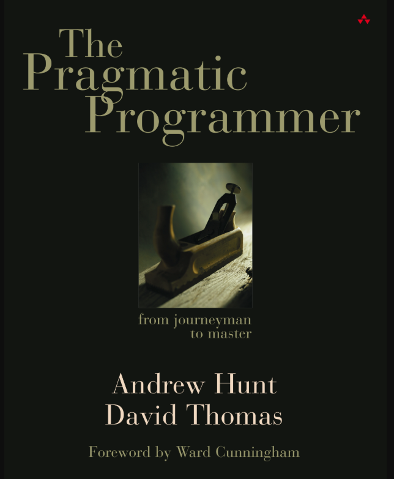

Hello everyone,

I just finished The Pragmatic Programmer: From Journeyman to Master by Andrew Hunt and David Thomas. First let me give a brief summary of what it's about before we get into the nitty gritty. 

### What is The Pragmatic Programmer about?
This book is a programmer's handbook, or manual if you will, on adopting the best practices and methodologies of computer programming in order to excel at it. The word pragmatic means "to deal with things in a realistic and sensible way that is based on practical rather than theoretical knowledge" and that is what this book embodies. It is not focused on specific programming languages and/or technologies but rather the best and most effective ways to utilize the wide array of technologies at the disposal of the modern programmer while emphasizing the importance of good communication and teamwork. 

### Personal Review of The Pragmatic Programmer:
This book is all about teaching you the many life lessons the authors have learned through their work as computer programmers. It largely ignores the technical side of programming and focuses on the "big picture" which in this case are the foundational principles of computer programming along with good soft skills for effective collaboration efforts. I like how the authors focus on these areas as I feel they are largely ignored in today's programming community. Today's new programmers are focused on the latest new technologies which is the wrong approach. The right way of learning computer programming, or any other field for that matter, is to develop the foundational knowledge first then move into the specifics such as programming languages and technologies. What is the foundational knowledge for computer programming you ask? They are the D.R.Y principle, S.O.L.I.D principles, and 23 design patterns of software design, to name a few. You can learn more about good programming principles [here](https://github.com/webpro/programming-principles).

The importance of good communication and soft skills in the field of computer programming are also heavily touched on in this book, with which I wholeheartedly agree. The book touches on how to interpret client requirements in order ensure the finished product is to the client's exact specifications. The authors frequently remind the reader: "The software you build is not what you want to build, but rather what the client requires and expects". Another skill of client-programmer interactions is the ability to discern what the client says they want in a software versus what they are actually asking for. This confusion happens all too often because the client's and programmer's definitions for various designs, features and functionalities don't always align. For example the client might call a registration form a sign-in form to which the programmer might assume a login page, when in reality the client is referring to a register page. One solution the book suggests to overcome this is to make a glossary of terminologies that the client and programmer should collectively add to and look over to make sure that each of them are referring the same things. I think the usage of a glossary is an excellent way of standardizing specifications and that is what make this book stand out for me. 

Overall this is a mandatory read for new computer programmers because it guides you in the right path to improvement in computer programming while allowing you to learn from and minimize the mistakes that the book details thoroughly. There is more to programming than meets the eye😜

Well that's all for today, I hope you found this review helpful. I would greatly appreciate if you could check out my [Youtube channel](https://www.youtube.com/channel/UCtxed_NljgtAXrQMMdLvhrQ?), follow me on [Twitter](https://twitter.com/Shehan_Atuk), [LinkedIn](https://www.linkedin.com/in/shehan-a-780622126/), [Github](https://github.com/ShehanAT) and [Instagram](https://www.instagram.com/shehanthewebdev/).
