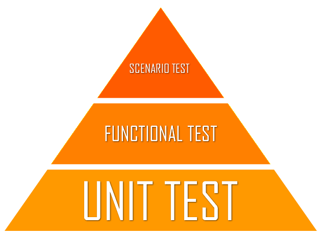

Hello everyone,

Today I'm going to explain how to implement unit tests for models and controllers in a Ruby on Rails app. This generic app will use RESTful web services by using the HTTP protocol along the with RESTful methods: POST, GET, DELETE, PUT. But first let's go over some basic definitions.


<p align="center">Figure 1: Unit tests are the base for all testing</p>

### What is Unit Testing and why is it important?
Unit testing is a way of testing each individual component of an application without a focus on how the app works in its totality. Rather, unit tests make sure to test the individual components, testing individual lego blocks before testing structures make out of lego blocks if you will, before all other types of testing are done. 

Why are unit tests important you ask? Let us think of building software applications as analogous to constructing a house, of the sake of clarity. When building a house the foundation, which is the basement area of the to-be house, is built first, because having a strong and stable foundation allows the house to withstand external forces well and allows for additional rooms to be built. Similarly in software development, unit tests ensures that individual components work as expected, while being independent of each other, before integrating the components together to complete the application. 

### Unit Testing in Ruby On Rails:
Ruby On Rails comes with testing packages pre-built so it is very easy to start uniting testing. Rails uses the Active Support Core Extension as default for unit testing so let's go along with that.

### Unit Testing Models: 
In order to unit test a model we will need a model, for generating a corresponding database table, and a unit test file. Both of these can be auto-generated using the Rails CLI. Let's say we want an ```article``` model with a title field and category field of type string. To generate it we would run: ```rails generate model article title:string category:string```. This command creates a ```article.rb``` file in the ```app/models``` directory and ```article_test.rb``` file in the ```test/models``` directory. 

Now just open the ```article_test.rb``` file and uncomment the first test you see, it should look like this: 
```
 test "the truth" do
    assert true
  end
```
This test is a sanity check rather testing the actual model, so let's run it by running the command: ```rails test RAILS_ENV=test```. Now you should see some green symbols along with ```1 runs, 1 assertions, 0 failures, 0 errors, 0 skips``` at the end. This message is to indicate that all unit tests pass, so let us add another basic unit test right below the one we uncommmented: 

```
test "should return truthy article model" do
    article = Article.new 
    assert article, "article is not truthy"
end 
```
This test creates an instance of the Article model and checks for truthiness, basically asking: is the ```article``` object an instance of the model ```Article```? After running all tests with ```rails test RAILS_ENV=test``` you should see ```2 runs, 2 assertions, 0 failures, 0 errors, 0 skips```. If you do, congrats we are well on our way to writing more complex tests.

I will stop here for the sake of brevity, but stay tuned for part 2 of this mini-series where I unit test associations and validations for models using Ruby On Rails.

Well that's all for today, I hope you found this review helpful. I would greatly appreciate if you could check out my [Youtube channel](https://www.youtube.com/channel/UCtxed_NljgtAXrQMMdLvhrQ?), follow me on [Twitter](https://twitter.com/Shehan_Atuk), [LinkedIn](https://www.linkedin.com/in/shehan-a-780622126/), [Github](https://github.com/ShehanAT) and [Instagram](https://www.instagram.com/shehanthewebdev/).
