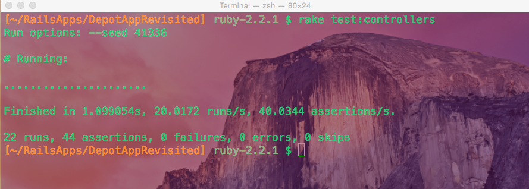

Hello everyone,

In this second part of the Unit Testing of Models in Ruby On Rails I will go more in depth on how to unit test models using model validations.


<p align="center">Figure 1: Unit testing in action.</p>

### Model Validation Unit Testing
Continuing with the Article model from part 1, let's assume it has two attributes: title and body. Now, we want to invoke an ActiveRecord error whenever we try to save an instance of Article without title and body attributes. 
```
test "should not save article with empty title and body" do 
    article = Article.new 
    assert_not article.save, "article is saving without title and/or body fields"
end 
```
This test will pass if the calling of ```article.save``` returns an error, but let's go over the syntax of this test. The statement enclosed in double quotes between ``` test ... do``` is the name of this test, which will be use to differentiate between test when more test are added. The line ```article = Article.new``` is creating an instance of Article and assigning it to the variable ```article```. Note: the ```new``` mass assignment operator does not automatically save the object created with it, unlike the ```create``` operator which creates then saves the object if validations pass. Then the line ```assert_not article.save ...``` is checking for an error thrown by ActiveRecord, which is the model in the MCV framework we call Ruby On Rails, upon trying to save the object to the database. 

. So let's run this test and check if it passes. 
```
ArticleTest#should_not_save_article_with_empty_title_and_body
article is saving without title and/or body fields
 runs, 3 assertions, 1 failures, 0 errors, 0 skips
 ```
 Nope! The problem is that ```article``` is being saved when it shouldn't be. To fix this let's add two validations, one for title and other for body, in the ```Article``` model file. 
```
class ArticleModel < ApplicationRecord 
    validates :title, presence: true    
    validates :body, presence: true
end 
```
Notice the ```presence``` option set to true which does the work of making sure the corresponding fields exist before saving the object to the database. 

Now let's run the test...
```
Finished in 0.208449s, 14.3920 runs/s, 14.3920 assertions/s.
3 runs, 3 assertions, 0 failures, 0 errors, 0 skips
```
And the test passes! Now we can be sure that validations are working whenever we run ```rails test RAILS_ENV=test``` through the passing of the ```ArticleTest#should_not_save_article_with_empty_title_and_body``` unit test. 

That concludes the unit testing of models in Ruby On Rails. Did we cover everything regarding model testing in Rails? No, but we covered the basics and that is sufficient for now. In the future I will write more about this topic so stay tuned!

Well that's all for today, I hope you found this review helpful. I would greatly appreciate if you could check out my [Youtube channel](https://www.youtube.com/channel/UCtxed_NljgtAXrQMMdLvhrQ?), follow me on [Twitter](https://twitter.com/Shehan_Atuk), [LinkedIn](https://www.linkedin.com/in/shehan-a-780622126/), [Github](https://github.com/ShehanAT) and [Instagram](https://www.instagram.com/shehanthewebdev/).
