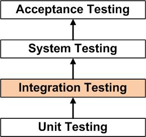

Hello everyone,

Integration testing is very important to the development of software applications. Today I will explain what integration testing is and show how to implement a basic integration test for a sample Ruby On Rails app along with explaining what Capybara is.


<p align="center">Figure 1: Integration testing is the second building block in the overall testing schema.</p>

### What Is Integration Testing?
Integration testing is testing of the integration of individual components of software applications. Basically this is a step up from unit testing. Whereas in unit testing we test individual components, in integration testing we combine those already tested components and test how the components work together as a whole. 

### How Do We Use Integration Testing In Ruby On Rails?
We use the ActionDispatch::IntegrationTest library included with Ruby on Rails and the Capybara testing framework for integration testing. 

Capybara is an acceptance testing framework but can be used for integration testing as well. Capybara can be used along with other testing frameworks such as Cucumber, Rspec and Minitest making it very versatile. 

### Installing Capybara
Capybara should be already installed if you're using Rails 6.0.0 or higher but if it's not then run this command:```gem install capybara``` and add ```gem 'capybara', '~> 3.29.0'``` to your Gemfile. 

### Basic Integration Test 
Integration tests are mainly used on controllers for Ruby on Rails applications. So let's create a controller for a sample application called ```Aricles```. Run ```rails generate controller Article``` in the command line. This should generate five files:```app/views/article```, ```app/helpers/article_helper.rb```, ```app/assets/stylesheets/article.scss```, ```app/controllers/article_controller.rb``` and ```test/controllers/article_controller_test.rb```. The ```app/views/article``` is the ```.html.erb``` file used for rendering the content of the view and the ```app/controllers/article_controller.rb``` file is the corresponding controller file. These two files will be our focus along with the ```article_controller_test.rb``` file for writing our integration tests. 

Let's start by uncommenting the default test in the ```article_controller_test.rb``` file:```test "the truth" do...```. This test acts as a sanity check and confirms that errors in the testing are solely application based and not because of the underlying infrastructure. Now let's add our first test:
```
test "should return 200 status code on get /welcome request" do 
    get "/welcome"
    assert_response :success
end 
```

This test sends a GET request to the url ```/welcome``` and expects a 200 status code, meaning the request/response cycle was successful. Let's run this test by typing ```rails test RAILS_ENV=test``` and see what happens:
```ruby
ActionController::RoutingError: No route matches [GET] "/welcome"
test/controllers/article_controller_test.rb:9:in `block 
in <class:ArticleControllerTest>'
```
An error like this should be render to the command line. Reason being we haven't defined a route for the "/welcome" url. Let's fix this by navigating to our ```routes.rb``` file located at ```config/routes.rb``` and add this line ```get "/welcome", to: "article#index"``` to it. Now go to ```app/controllers/article_controller.rb``` and add this action to it:
```
def index 
end
```
Then create a file called ```index.html.erb``` in the ```app/views/article``` directory. Finally run all tests with ```rails test RAILS_ENV=test```. The failing test should now pass. 

So let's go over what we just did. First we defined the route for the url ```/welcome``` by adding ```get "/welcome", to: "article#index"```. The ```to``` section defines the controller action responsible for handling the request to the ```/welcome``` url, in this case the ```index``` action of the Article controller. Then we added the action to handle the request in the ```article_controller.rb``` file. An action basically contains the logic to be executed upon receiving requests configured in the ```routes.rb``` file. Notice we did not include any code inside the action itself. This is because by default the action will render a ```.html.erb``` file corresponding to it's name. So when the ```index.html.erb``` file was added to the ```app/views``` directory the action automatically knew to render that view and in doing so made the integration test we added pass. 

I will end here for the sake of brevity, but stay tuned for part 2 where I show how to use Capybara for integration testing. 

Well that's all for today, I hope you found this review helpful. I would greatly appreciate if you could check out my [Youtube channel](https://www.youtube.com/channel/UCtxed_NljgtAXrQMMdLvhrQ?), follow me on [Twitter](https://twitter.com/Shehan_Atuk), [LinkedIn](https://www.linkedin.com/in/shehan-a-780622126/), [Github](https://github.com/ShehanAT) and [Instagram](https://www.instagram.com/shehanthewebdev/).
