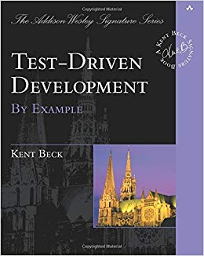

Today's post will be on a book review of Test-Driven Development By Example By Kent Beck. 

Figure 1: The Test-Driven Development Bible

### Summary of Test-Driven Development By Example
This book, written in 2000, is about how to practice test development through the use of numerous practical examples. The author, Kent Beck, is a accomplished software developer who has written many other books such as Extreme Programming, JUnit Pocket Guide and Implementation Patterns. The book is divided into two sections: section 1 is about making an application that deals with currency and section 2 includes some general advice on test-driven development best practices, some theoretical speculations and other miscellaneous material. So without further ado let's get into the review!

### Personal Review 
The first section of this book is amazing for people who love learning through example. The book details the making of a currency application where Francs, France's currency, are converted into US dollars and visa versa through the test-driven development methodology. Each chapter in this section, 16 in all, builds on top of the progress of the previous chapter. For example, the chapter "Mixed Currencies" dwells into making an interface called Expression which implements the plus() method. This method does exactly as it sounds, it adds two integers and returns the sum. The author focuses on makes changes that ripple through the development process. With an emphasis on going slow, meaning not to make too many changes between running tests, a failing test is written first. Then a change to the Money classes reduce() method is made to make the test pass. After that, it is time to refactor through the addition of the augend and addend attributes of type Expression to the Sum class and changing the argument of Money's plus() method from Money to Expression. An error is thrown as a result of these changes which invokes the next series of changes and the whole process repeats. So as you see the process of test-driven development: write failing test, make failing test pass through whatever means necessary, and finally removing duplication of any sort in order to avoid dependency, is detailed through practical examples which is the highlighting feature of this book. 

One thing this book engrained into my brain is the avoidance of duplication, whether it be data duplication or redundant code. Duplication leads to dependency which leads to a rigid and inflexible code base which leads to massive issues with application scalability and maintenance which leads to major bugs which ultimately leads to project failure and/or abandonment. Through transitivity, we can imply that duplication leads to project failure and/or abandonment so avoid it at all costs. 

The second section of the book goes over guidelines and tips to successfully integrate test-driven development as a habit when making applications. The author includes his answers on various questions regarding test-driven development such as: Is TDD(Test-Driven Development) sensitive to initial conditions? Can you drive development with application-level tests? and Why does TDD work? Also included is the importance of realizing when to take breaks and when to push through laziness in the process of software development. 

TDD gives applications pragmatism in that we can have great confidence in the applications built through it. This is the main idea of the whole book and is one I agree with. This book is so full of examples and practical advice that it deserves many re-readings. So in closing, this book is a must read for people interested in starting TDD or those who want to further develop their TDD skills. 

Well that's all for today, I hope you found this review helpful. I would greatly appreciate if you could check out my [Youtube channel](https://www.youtube.com/channel/UCtxed_NljgtAXrQMMdLvhrQ?), follow me on [Twitter](https://twitter.com/Shehan_Atuk), [LinkedIn](https://www.linkedin.com/in/shehan-a-780622126/), [Github](https://github.com/ShehanAT) and [Instagram](https://www.instagram.com/shehanthewebdev/).
