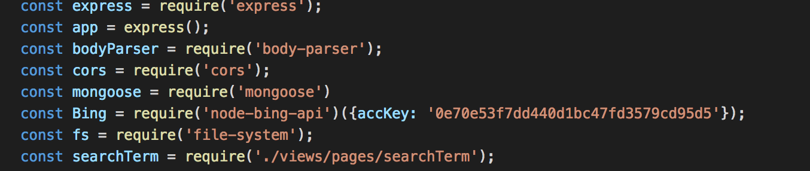

This challenge was done with the help of Coding Tutorials 360 , click [HERE](https://www.youtube.com/user/pizzapokerguy87) to visit his youtube page.

Although this was a relatively easy project the hard part was getting a api key from the Bing Web Search Api website. Making an account and then requesting an api key took about 15 minutes.

Now that we have an api key, we need to install all the dependencies for the project. Here is what it looks like:


(Don't worry, the API key is expired)
Notice the api key is listed with the Bing requirement

App.get() request was used to connect to the Bing api and the search parameter was input is this format in the address bar:

```localhost:5000/api/imagesearch/{search term}```

Doing so makes the bing api return back a json object filled with the information the search term requested. The complicated parts are done and all that has to be done is to format the information into a presentable manner. An array was used to store the url, snippet, thumbnail, and context of each received search result and finally I used res.json(array) to output the images to the front end.

Overall, it was a fun project but more importantly it sharpened my skills as a Node.js developer