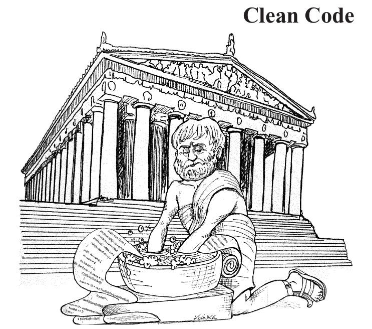

Ever wanted to simiplify your views, make them look neater and more organized? Use helpers! In this post we will go over how to use helpers in Ruby on Rails. This won't be an in-depth guide but rather a basic overview on how to use helpers. 


<p align="center">Figure 1: Always Write Clean Code</p>

### What are helpers in Ruby on Rails?
Helpers are exactly as they sound, they help developers produce clean code that adheres to the DRY(Don't Repeat Yourself) and S.O.L.I.D programming principles. On top of being able to create custom helpers, Rails comes equipped with several built-in helpers such as link_to, button_to, form_with and many more. We will go over how to make your own custom helpers in this post. 


### Custom helper in the views:
So let us say we have a ```home.html.erb``` file in the ```views/game``` directory of some arbitrary project. It contains the code:
```
<body>
    <div class='questions_section'>
        <a href='/questions' id='questions_link'>Quizzes</a>
    </div>
</body>
```
We can simplify this code by using a helper. Navigate to the ```app/helpers``` directory and create a new file called ```game_helper.rb```, if not already created. Inside the module tag include the following method:
```
module GamesHelper

    def render_quizzes_link 
        content_tag(:div, :class => 'questions_section') do 
            content_tag(:a, "Quizzes", :id => 'questions_link', :href => '/questions')
        end 
    end 
end 
```
then go back to the view file ```app/views/game/home.html.erb``` and change it to:
```
<body>
    <%= render_quizzes_link %>
</body>
```
Now navigate to the page on your browser and it should render the same content as before but this time with a much cleaner syntax. The best part about custom helpers are that they can be used freely and all it takes to change the content is to modify the original helper in the ```helpers/games_helper.rb``` file. 

Now let's do a more complex example. Assume in the same ```app/views/game/home.html.erb``` file we have two buttons: login and logout that show based on the authentication status of the current user:
```
<div>
    <ul>
        <li>
            <% if session[:loggedIn] %>
                <a href='/sessions/new' id='login_link' >Login</a>
            <% else %>
                <a href='/sessions' id='logout_link' 
                rel='nofollow' data-method='delete'>Logout</a>
            <% end %>
        </li>
    </ul>
<div>
```
To refactor this with a helper go to the same helper file ```app/helpers/game_helper.rb``` and add this method:
```
module GamesHelper 

    def render_authentication_link 
        if session[:loggedIn]  
            content_tag(:li) do 
                link_to "Logout", sessions_path, method: "delete", id: "logout_link"
            end 
        else 
            content_tag(:li) do
                link_to "Login", new_sessions_path, id: "login_link"
            end 
        end 
    end 
end 
```
Then add the helper to the ```app/views/game/home.html.erb``` file:
```
<div>
    <ul>
        <%= render_authentication_link %>
    </ul>
<div>
```
Now if we navigate to that page in the browser we should see the appropriate link based on the current authentication status of the user. Note: this implementation assumes you are setting the session variable ```loggedIn``` to true when a user logs in and false when they logout. 

### Closing Notes
This is by no means a complete guide to helpers and I will continue to make posts explaining the other ways in which helpers can be utilized. When I first learned how to use helpers I was fascinated by them and I hope you will be too.


Well that's all for today, I hope you found this review helpful. I would greatly appreciate if you could check out my [Youtube channel](https://www.youtube.com/channel/UCtxed_NljgtAXrQMMdLvhrQ?), follow me on [Twitter](https://twitter.com/Shehan_Atuk), [LinkedIn](https://www.linkedin.com/in/shehan-a-780622126/), [Github](https://github.com/ShehanAT) and [Instagram](https://www.instagram.com/shehanthewebdev/).
