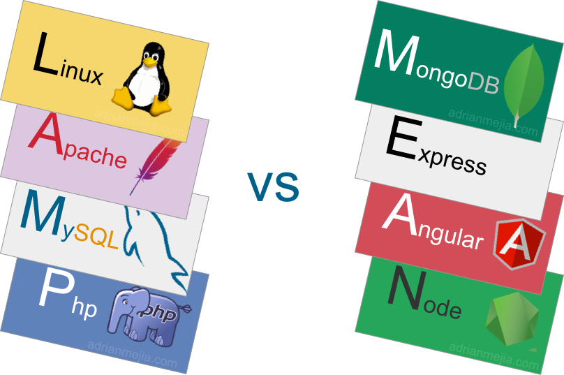

Just updating on where I'm at here. So I decided to continue with the FreeCodeCamp Back  End Dynamic Web projects. They are significantly harder than  the previous projects because they require you to use multiple web technologies such as Node.js, Angular.js and Git. I am using  the MEAN stack to make this project. For those of you that don't know the MEAN stack consists of MongoDB, Angular.js, Express.js and Node.js.

There are two main stacks that I know of, MEAN and LAMP. The differences between the MEAN stack and its rival LAMP stack are as follows:
* LAMP stack can only operate on Linux, MEAN stack can operate on Windows, Mac, and Linux
* LAMP web server is Apache, MEAN web server is Node.js
* MEAN uses MongoDB as the Data Store while LAMP uses MySQL
* MEAN web presentation consists of using Express.js and Angular.js and LAMP web presentation is provided by PHP and Python

I decided to go with MEAN because I don't use Linux and I prefer Javascript over Python and PHP.

Anyway, I have to get back to working on my project but I'll keep you guys updated.