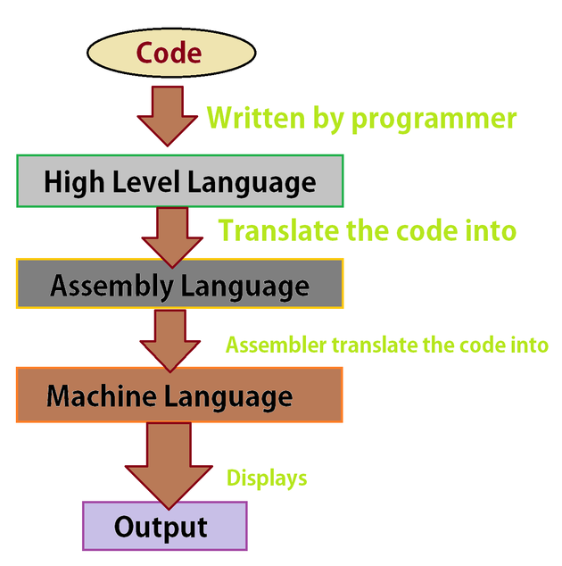

When it comes to low level languages that work closely with machine code instructions look no further than the Assembly Programming Language. In this post we will go through the basic syntax and commands used in the Irvine32.inc library for Assembly programs. 

Figure 1: The Hierarchy Of Programming Languages

### What is Assembly?
Assembly is a low-level programming language that is very close to machine code. For the sake of reference, the hierarchy of programming languages from the base to the top consists of: machine code => Assembly Code => High Level Language(see Figure 1). So any code written in languages such C++, Java, C and JavaScript are broken down into Assembly code first before being compiled into machine code that the computer can understand. Therefore, the importance of the Assembly language cannot be understated because it serves as a bridge between high level languages and machine code.  

### Pros and Cons of learning Assembly
Writing Assembly code has its pros and cons. Let's start with the pros first: it is good for learning to program for IOT devices and single purpose devices with small amounts of memory, it is good for programming for game consoles which require their software to exploit of capabilities of the hardware to its fullest extent, and it is good for gaining a thorough understanding of how computer architectures, operating systems and application programs work. 

The cons of Assembly are: since it is designed for specific computer architectures, it is not portable. This means that a program designed for the Motorola 68x00 processor family will not work on the IBM-370 processor family. This lack of portability is in sharp contrast to languages such as C++ where programs written by it can run on many different architectures and processor families. 

### Overview of the Assembly Syntax:
Although it is a close to the metal, meaning more of a lower-level programming language, than C++ and Java, the Assembly syntax is not as strict. This gives Assembly programmers more freedom than their high-level language counterparts. For example specific memory addresses which cannot be accessed in Java, can be in Assembly allowing programmers to access any memory address at will. But the downside to this freedom is that errors are easier to make and more prevalent in Assembly than most other programmings languages. An analogy for this is: High level programming languages are like kids learning to ride a bike with training wheels on, whereas Assembly is akin to learning to ride the bike without the training wheels. There is more freedom to maneuver and speed up but at the risk of losing balance and falling of the bike. 

### Basic Execution Environment In Assembly
Assembly uses registers, which are storage spaces in the CPU, for 8-bit, 16-bit, 32-bit, and 64-bit processors. The registers of the smaller bit processors are parts of the registers for the larger bit processors. For example the AX 16-bit register is split into two 8-bit registers, AH being the upper half and AL being the lower half. 

There are some registers that are assigned specific duties such as: 
* EAX: used for multiplication and division operations.
* ECX: used in loops as counters.
* ESP: used to address data on stacks.
* ESI: used for high speed memory transfers.

Assembly also uses status flags that reflect the outcomes of arithmetic and logical operations. Some of these include: 
* Zero flag: set when a arithmetic operation generates a result of 0.
* Carry flag: set when an unsigned integer is too large to fit in the destination address.
* Overflow flag: set when a signed integer is too large to fit in the destination address. 

General purpose registers are used to store, change and loop through data in the x86 processor architecture. A register extension(REX) can be used to extend the amount of registers used by a particular bit mode. For example: in 64-bit mode 8 registers are available by default but with the addition of the REX prefix 16 registers are available. 

### Closing Notes 
I will leave off here for the sake of brevity. In the next post we will cover the various commands and directives used in the Irvine32.inc library for the Assembly programming language. 

Well that's all for today, I hope you found this review helpful. I would greatly appreciate if you could check out my [Youtube channel](https://www.youtube.com/channel/UCtxed_NljgtAXrQMMdLvhrQ?), follow me on [Twitter](https://twitter.com/Shehan_Atuk), [LinkedIn](https://www.linkedin.com/in/shehan-a-780622126/), [Github](https://github.com/ShehanAT) and [Instagram](https://www.instagram.com/shehanthewebdev/).
