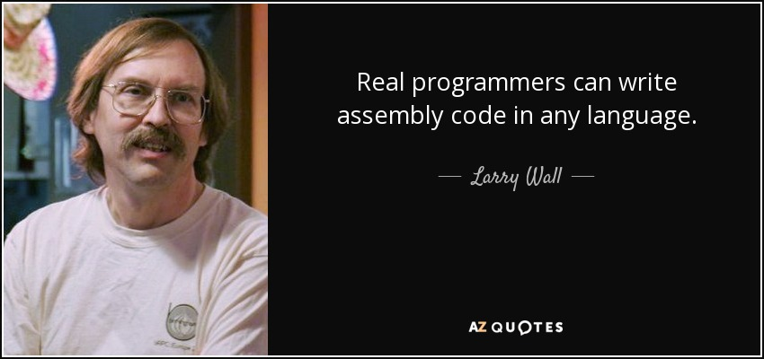

The Assembly programming language has been around longer than most people reading this were born. This long history allowed for the development of many instructions and directives unique to the Assembly programming language. Today we will explore some basic instructions pertaining to data transfers and addressing.  


<p align="center">Figure 1: Wise words From Larry Wall, creator of Perl programming language</p>

### Variables And Directives In Assembly 
Variables in Assembly have different data types than those in high level programming languages. These data types are more formerly known as directives. The data type must be specified in accord with its corresponding bit value. For example, defining an 8-bit variable called ```hello``` containing the value 10 would look like this:``` hello BYTE 10h```. This first operand is the variable name, second is the directive and third is the value. Note: the ```h``` suffix denotes the value is in hexadecimal form. 

Here is a brief table illustrating variable type names and their corresponding values in Assembly:

| Directive | Used For |
| ----- | ----- |
| BYTE  | 8-bit unsigned integers |
| SBYTE | 8-bit signed integers |
| WORD  | 16-bit unsigned integers |
| SWORD | 16-bit signed integers |
| DWORD | 32-bit unsigned integers | 
| SDWORD | 32-bit signed integers |
| FWORD | 48-bit integers | 
| QWORD | 64-bit integers | 
| TBYTE | 80-bit integers | 


### Data Transfer Instructions
When it comes to data transfer instructions the one that immediately comes to mind is the MOV instruction so let's go through what it does. 

MOV instruction copies data from a source to a destination, or in other words, it moves data from one location to another. Note: this instruction cannot be used to directly move data from one memory address to another. You must go through a register in order accomplish this. 


The MOVZX instruction is similar is MOV with the addition of zero-extending unused bit values. This means that the a value such as 10h will be 00000010h after data transfer with MOVZX. 

The MOVSX instruction is also a very useful instruction in that it can be though of as the opposite of MOVZX. This is because it adds 1's to any a value that has its highest bit set to greater than 7. For example, F056h would become 1111F056h under data transfer of the MOVSX instruction. 

So let's see the MOV instruction in action! In order to move the variable ```hello``` in the EAX register to the EBX register we would run:```mov ebx eax```. Simple, right? 

### Closing Notes 
There are some other data transfer instructions we have not covered in this post such as the LAHF and SAHF, but these require knowledge of status flags, what they are and how they work. Therefore, aforementioned topics will covered in the next post along with other useful Assembly instructions. 

Well that's all for today, I hope you found this review helpful. I would greatly appreciate if you could check out my [Youtube channel](https://www.youtube.com/channel/UCtxed_NljgtAXrQMMdLvhrQ?), follow me on [Twitter](https://twitter.com/Shehan_Atuk), [LinkedIn](https://www.linkedin.com/in/shehan-a-780622126/), [Github](https://github.com/ShehanAT) and [Instagram](https://www.instagram.com/shehanthewebdev/).
