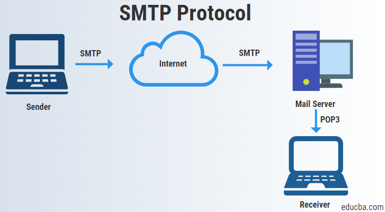

Ever wanted to implement a password reset form or a mailing list feature but didn't know how? Use Action Mailers! They are a useful tool that brings email service to Ruby On Rails via SMTP. 


<p align="center">Figure 1: Diagram Of SMTP Protocol</p>

### Introduction 
Let's assume we want to implement a password reset form that emails a password reset link to an entered email address. To do this we will need a action mailer. The plan is to create an action mailer called UserMailer and set it up to send a custom password reset form via email. The email will contain an auto generated link that redirects the user to a password reset form. Although we will skip over the implementation of password reset functionality, how to use an action mailer to send a form via email will be covered. 

### Setting Up
First, make a new Rails app called "article" by running:```rails new article```. Then generate a scaffold via: ```rails generate scaffold article title body:text```. This should create an article controller, model, view folder, test folder and stylesheets. Now we need to create an action mailer called "user mailer" by running:```rails generate mailer UserMailer```. Navigate to the newly generated ```app/mailers/user_mailer.rb``` file. In it we will add a method:
```
default from: "#{YOUR_DEFAULT_EMAIL}"

def password_reset(user)
    @user = user 
    mail :to => user.email, :subject => "Password Reset"
end 
```

Enter your default email address into the ```default from:``` field as this is the sender's email address. Now navigate to the empty folder: ```app/views/user_mailer```, create a file called ```password_reset.text.erb``` and add the following content to it: 
```
To reset your password click the link below:

<%= edit_password_reset_url(@user.password_reset_token) %>

If you did not request to change your password just ignore this email and your password will stay the same.
```
As previously mentioned, the implementation of password resetting will not be covered so you can hardcode a url for now such as:
```
To reset your password click the link below:

<%= link_to "www.example.com/password_reset", articles_path %>

If you did not request to change your password just ignore this email and your password will stay the same.

```

There is some additional code to be included in the ```development.rb``` file:
```
# config/environment/development.rb

 ActionMailer::Base.delivery_method = :smtp

  ActionMailer::Base.smtp_settings = {
  :address              => "smtp.gmail.com",
  :port                 => "587",
  :domain               => "#{ENV["EMAIL_PROVIDER"]}",# eg: gmail.com
  :user_name            => "#{ENV["EMAIL_USERNAME"]}",
  :password             => "#{ENV["EMAIL_PASSWORD"]}",
  :authentication       => "plain",
  }
```
Do not forgot to set some ENV variables with the values of your email provider name, email username and email password. This is done to prevent public exposure of your credentials when checking in your code into version control systems such as Github. 

To view how the emails you send will look like fire up the server by running: ```rails server``` then navigate to ```http://localhost:3000/rails/mailers/user_mailer/user_mailer_preview```. The email to be sent should now be displayed, albeit with a fake url but that's okay for now. 

### Closing Notes 
Hopefully the mailer works at this point, if not email me for guidance at shehanatuk.com. All in all this is a pretty neat feature of Rails because of the ease at which emails can be sent with. Stay tuned for the implementation of password reset functionality which I will cover in my next post. 


Well that's all for today, I hope you found this review helpful. I would greatly appreciate if you could check out my [Youtube channel](https://www.youtube.com/channel/UCtxed_NljgtAXrQMMdLvhrQ?), follow me on [Twitter](https://twitter.com/Shehan_Atuk), [LinkedIn](https://www.linkedin.com/in/shehan-a-780622126/), [Github](https://github.com/ShehanAT) and [Instagram](https://www.instagram.com/shehanthewebdev/).
