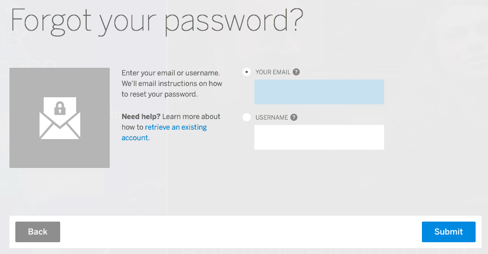

How many times have you used a password reset feature because you forgot your password to some website? Password reset forms are a very useful feature in today's internet, because most websites require some sort of user authentication. That is why we will go over how to implement a password reset form for a Ruby On Rails application in this post. 


<p align="center">Figure 1: Example of a password reset form.</p>

### What You Will Need
Before starting make sure you have a scaffolded Rails application. I will use the Article scaffold for this post. Also we will need an UserMailer action mailer, CreateUserTable migration, User model, password reset controller and some view files. So without further ado, let's get started!

### Setup 
First let's create our models and migrations. We will need to create the user table using a migration as follows:
```
    create_table :users do |t|
        t.string :username,    null: false, default: ""
        t.string :email,       null: false, default: ""
        t.string :password,    null: false, default: ""
        t.string :p_salt
        t.string :fullName
        t.text :bio 
        t.string :password_reset_token
        t.datetime :password_reset_sent_at
        t.timestamps
    end 
```

We will need one models: Users
```
# user.rb 
class User < ApplicationRecord
    before_create { generate_token(:auth_token) }

    def send_password_reset 
        generate_token(:password_reset_token)
        self.password_reset_sent_at = Time.zone.now 
        save!
        UserMailer.password_reset(self).deliver 
    end 

    def generate_token(column)
        begin 
            self[column] = SecureRandom.urlsafe_base64
        end while User.exists?(column => self[column])
    end 
```
The ```before_create``` method calls the ```generate_token``` method before creating a new user, The ```password_reset_token``` method uses an action mailer to email the user the reset link, and the ```generate_token``` method generates a unique authentication token for each user record in the database. 

Before we forget lets define our routes in the ```config/routes.rb``` file as such:
```
Rails.application.routes.draw do
  root 'articles#index'
  resources :users
  resources :password_resets
end
```
You can set the link to navigate to the password reset form by including 
```
<%= link_to "Forgot Password?", new_password_reset_path, :id => "password_reset_link" %>
``` 
where you think is appropriate. I will include this link in the root url for now.


Now let's create our password reset controller by running:```rails generate controller PasswordResets```. Remember to always pluralize controller names and file names as this is Rails convention. Now navigate to ```app/controllers/password_resets_controller.rb``` and adding the following:
```
# password_resets_controller.rb
    def new
    end 

    def create 
        user = User.find_by_email(params[:email])
        if user
            user.send_password_reset  
        else
            return redirect_to new_password_reset_path, 
            :notice => "Email Not Found! Please Enter A Valid Email"
        end 
        return redirect_to root_url, :notice => "Email Sent 
        With Password Reset Instructions"
    end

    def edit
        @user = User.find_by_password_reset_token!(params[:id])
        respond_to do |format|
            format.html { render "edit" }
            format.js { render "edit" }
        end 
    end 

    def update
        @user = User.find_by_password_reset_token!(params[:id])
        if @user.password_reset_sent_at < 2.hours.ago 
            redirect_to root_url, :notice => "Password Reset Has Been Expired"
            respond_to do |format|
                format.js { render "edit" }
                format.json { render json: {status: false, 
                message: "Password Reset Token Has Been Expired. 
                Please Restart The Reset Process." } }
            end 
        elsif @user.update(:password => params[:password])
            respond_to do |format|
                format.js { render "edit", flash[:notice] => "Password
                 Has Been Reset!" }
                format.json { render json: {status: true, 
                message: "Password Has Been Reset!" } }
            end
        else 
            respond_to do |format|
                format.js { render "edit" }
                format.json { render json: {status: false,
                 message: "Password Failed To Update!" } }
            end
        end 
    end 
```
The new action renders the initial form where the user enters their email address. Then the create action uses the action mailer to send an email containing a password reset link to the user's email address and finishes off by redirecting to the root url. The edit action, which is triggered when the user navigates to the link provided in the email, renders the form where the user enters their new password, then upon submission the update action updates the user's password stored in the database. 

On to the views! In the ```app/views/password_resets``` folder create three files:```new.html.erb```, ```edit.html.erb```, and ```edit.js.erb```. The content for each file is shown below:
```
# new.html.erb
<%= form_with(url: password_resets_path) do |form| %>

<%= form.label(:email, "Enter The Email Address Associated With Your Account: ") %>
    <div id="send_reset_email_errors" >
        <% if flash[:notice] %>
            <p class="error"><%= flash[:notice] %></p>
        <% end %>
    </div>
<%= form.text_field(:email) %>    
</br>
<%= form.submit("Reset Password", :id => "reset_password_submit") %>

<% end %>
```

```
# edit.html.erb
<%= form_with(model: @user, url: password_reset_path(params[:id]),
 method: :put, :remote => true) do |form| %>
    <div id="password_reset_errors">
        <% if @user.errors.any? %>
            <% @user.errors.has_messages.each do |error| %>
                <p class="error"><%= error %></p>
            <% end %>
        <% end %>
    </div>
<%= form.label(:password, "Enter New Password: ") %>
<%= form.password_field(:password) %>
</br>

<%= form.label(:confirm_password, "Confirm New Password: ") %>
<%= form.password_field(:confirm_password) %>

<%= form.hidden_field(:password_reset_token) %>
<%= form.submit "Update Password" %>

<% end %>
```
and
```
# edit.js.erb
$("#password_reset_errors").html("");
if($("#user_password").val() === "" || $("#user_confirm_password").val() === "" ){
    $("#password_reset_errors").append("<p class='error'>Password 
    Fields Cannot Be Empty</p>");
}
else if($("#user_password").val() === $("#user_confirm_password").val()){
    $.ajax({
        url: "/password_resets/" + $("#user_password_reset_token").val(),
        method: "PUT",
        dataType: "json",
        data: {
            password: $("#user_password").val(),
            authenticity_token: window._token
        },
        success: function(data){
            if(data.status){
                alert("Password Has Been Reset!");
                window.location.href = "/";
            }
        }
    });
}
else{
    $("#password_reset_errors").append("<p class='error'>Passwords Do Not Match</p>");
}
```

The HTML files are the forms to be rendered and the JS file handles form validations and remote submission via AJAX call. 

Then we will need an action mailer, generate one by running: ``` rails generate mailer UserMailer```. Navigate to ```app/mailers/user_mailer.rb``` and add the following method: 
```
class UserMailer < ApplicationMailer
    default from: "#{ENV["YOUR_DEFAULT_EMAIL"]}"
    
    def password_reset(user)
        @user = user 
        mail :to => user.email, :subject => "Password Reset"
    end 
end
```
I recommend you use ENV variables to sent your email credentials as this is the best option to keep your credentials safe. Set the ```default from:``` field to the email you will send emails from. The ```password_reset``` method handles email submission. 

After this, we will need to make the file to be rendered as the email body. Following Rails convention we will call this file ```password_reset.text.erb``` and place it in the ```app/views/user_mailer``` folder. Add something along the lines of this to it:
```
To reset your password click the link below:

<%= edit_password_reset_url(@user.password_reset_token) %>

If you did not request to change your password just 
ignore this email and your password will stay the same.
```
The ```password_reset``` method will automatically render this file for the email body without explicit definition. 


Finishing off the action mailer, we will have to define some email configurations in the ```config/environment/development.rb``` file:
```
 ActionMailer::Base.delivery_method = :smtp

  ActionMailer::Base.smtp_settings = {
  :address              => "#{ENV["YOUR_EMAIL_PROVIDER_ADDRESS"]}", # eg:"smtp.gmail.com"
  :port                 => "587",
  :domain               => "#{ENV["YOUR_EMAIL_PROVIDER"]}",
  :user_name            => "#{ENV["GMAIL_USERNAME"]}",
  :password             => "#{ENV["GMAIL_PASSWORD"]}",
  :authentication       => "plain",
  }
```
This code snippet tells Rails how to send emails. Make sure to set the appropriate ENV variables for your corresponding email provider, username and password as without these the action mailer cannot send any emails. 


### Testing 
Now with the necessary files and code setup, test your application by running: ```rails server```, navigate to the password reset form by clicking the 'Forgot Password?' link and enter a test email. Your email should arrive in your inbox in about 2 minutes if everything is configured correctly. Now click the password reset link, which should redirect you to the form where you enter your new password. Submit that form, logout and log back in with your new password.

### Closing Notes 
Assuming everything went as expected, congragulations! You have setup up your own password reset form. If not, reach out to me on my social links listed below or email me your questions at shehanatuk@gmail.com. 

Well that's all for today, I hope you found this review helpful. I would greatly appreciate if you could check out my [Youtube channel](https://www.youtube.com/channel/UCtxed_NljgtAXrQMMdLvhrQ?), follow me on [Twitter](https://twitter.com/Shehan_Atuk), [LinkedIn](https://www.linkedin.com/in/shehan-a-780622126/), [Github](https://github.com/ShehanAT) and [Instagram](https://www.instagram.com/shehanthewebdev/).
