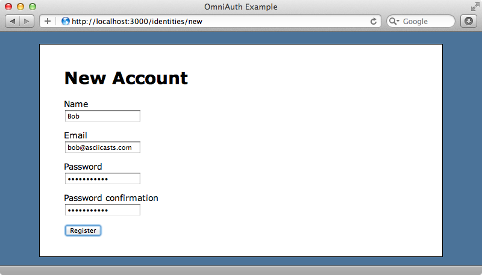

Forms are a vital part of the web. They allow us to communicate with each other in a very easy and effective way. Today we will learn how to set up a user registration form on a Ruby On Rails application. 


<p align="center">Figure 1: A Basic Registration Form.</p>

### What You Will Need
Before starting make sure you have a scaffolded Rails application. I will use the Article scaffold for this post. Also we will need a User model and Users controller which we will go over on how to create. So let's get started!

### Setup 
First let's create our migration. We will need to create the user table using a migration by running: ```rails generate migration AddUsersTable``` then adding the following snippet to the migration file located at ```db/migrate```.
```
    create_table :users do |t|
        t.string :username,    null: false, default: ""
        t.string :email,       null: false, default: ""
        t.string :password,    null: false, default: ""
        t.string :fullName
        t.text :bio
        t.string :password_reset_token
        t.datetime :password_reset_sent_at
        t.timestamps
    end 
```
Let's go over the migration: it creates a users table with the listed attributes in the database. To complete the migration run: ```rails db:migrate RAILS_ENV=development``` in the terminal. 

We will need one model: User. Run: ```rails generate model User``` to generate the User model then add the following code to the generated file:
```
# app/models/user.rb 
class User < ApplicationRecord
    validates_presence_of :username, :fullName, :bio
    validates_uniqueness_of :username 
    validates_uniqueness_of :email
    validates :email, format: { with: URI::MailTo::EMAIL_REGEXP }, presence: true
    validates :password, presence: true
    validates :password, confirmation: { case_sensitive: true }
end 
```
The User model contains validations for the attributes of the user table. These will ensure that ActiveRecord will make sure the validations pass before entering new records into the database as this will prevent incorrect information from entering the database. 

Let us create the user controller by running: ```rails generate controller UsersController```. Navigate to the ```app/controllers/users_controller.rb``` file and add the following code:
```
class UsersController < ApplicationController
    def new 
        @user = User.new 
        render "new"
    end 

    def create 
        user = User.new(params[:user])
        if user.save!
            flash[:notice] = "User created successfully"
            redirect_to root_url
        else 
            flash[:notice] = "User registration failed"
            render "new"
        end 
    end 
end
```
The new action renders the ```new.html.erb```, the file containing the registration form. The create action processes the submission and handles redirection. If the creation of a new user fails the registration form is re-rendered with a flash notice, which is basically a message to be displayed on screen, notifying the user of the unexpected failure. The ! at the end of ```user.save``` is a verbose flag that logs errors to the terminal. This makes debugging easier through the increase in transparency behind the scenes. 

On to the views! Navigate to the ```app/views/users``` folder and create a file: ```new.html.erb```. Add the following code to it:
```
<%= form_with(url: users_path, model: @user) do |form| %>
    <% if @user.errors.any? %>
        <div class="user_errors">
            <% @user.errors.full_messages.each do |error| %>
                <p><%= error %></p>
            <% end %>
        </div>
    <% end %>
<%= form.label :username, "Username: " %>
<%= form.text_field :username %>

<%= form.label :email, "Email: " %>
<%= form.text_field :email %>

<%= form.label :password, "Password: " %>
<%= form.password_field :password %>

<%= form.label :password_confirmation, "Confirm Password: " %>
<%= form.password_field :password_confirmation %>

<%= form.label :fullName, "Full Name: " %>
<%= form.text_field :fullName %>

<%= form.label :bio, "Bio: " %>
<%= form.text_field :bio %>

<%= form.submit "Submit" %>

<% end %>
```
This form is set up to send a user object as a submission parameter through the ```model: @user``` option in the ```form_with``` helper tag. Once the user clicks the submit button a user object containing all the necessary fields are sent to the create action. This was specified through ```users_path```, which is a named route. The conditional if statement near the top is for rendering errors caught by ActiveRecord validations defined in the User model. For example: if the end-user submits with an empty email field ActiveRecord will insert an error message into the ```@users.full_messages``` array which is then rendered on screen through the for loop. 

If you are wondering how the two password fields are validated it is done through the ```validates :password, confirmation: { case_sensitive: true }``` line in the User model. This line takes the two password fields and ensures that they are equal through string comparison. Note: for this validation to work it is imperative that the two password fields be called ```password``` and ```password_confirmation```, as anything other than this will throw an error. 

### Testing 
Now with everything setup up we have to define some routes in the ```config/routes``` file. Add the following to it:
```
Rails.application.routes.draw do
    root 'articles#index'
    resources :users
end
```
The ```root``` keyword sets the application homepage to be rendered by the index action of Articles controller and the ```resources``` keyword creates the CRUD operation routes for the Users controller. 

Start up the server through the command: ```rails server``` and navigate to the path ```/users/new```. You should see a registration form. Try submitting it with empty fields to verify that the errors are rendered on screen. Then try a success use case and the browser should redirect to the root url.

### Closing Notes 
If everything went well, congrats! You have set up your own registration form. But currently it is storing the password as a plain text string. This is very dangerous as the password is publicly exposed to anyone with access to the database file. To prevent this we must use password hashing, a method of encryption. Accordingly, that will be what the next post will be on so stay tuned!

Well that's all for today, I hope you found this review helpful. I would greatly appreciate if you could check out my [Youtube channel](https://www.youtube.com/channel/UCtxed_NljgtAXrQMMdLvhrQ?), follow me on [Twitter](https://twitter.com/Shehan_Atuk), [LinkedIn](https://www.linkedin.com/in/shehan-a-780622126/), [Github](https://github.com/ShehanAT) and [Instagram](https://www.instagram.com/shehanthewebdev/).
