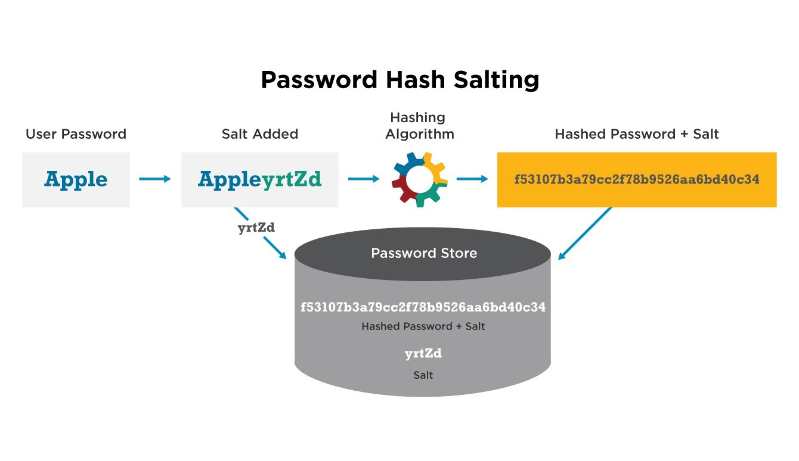

The value of a secure authentication system in today's day and age cannot be overstated. Major banks, governments and multinational corporations all use authentication systems to secure their assets and data. So let's learn how to make a basic user authentication system on Ruby on Rails today!


<p align="center">Figure 1: Diagram on password hashing and salting.</p>

### What You Will Need
Before starting make sure you have a scaffolded Rails application. I will use the Article scaffold for this post. Also we will need a User model and Users controller which were implemented in [this post about creating a submission form in Ruby on Rails](https://shehantips.com/10-22-2019). We will use BCrypt as the method of hashing and salting passwords so make sure to include it in your Gemfile by adding ```gem 'bcrypt', '~> 3.1.7'``` to it or running ```gem install bcrypt```. 

### Setup 
First we add some methods to our User models
```
# app/models/user.rb
class User < ApplicationRecord
    validates_presence_of :username, :fullName, :bio
    validates_uniqueness_of :username 
    validates_uniqueness_of :email
    validates :email, format: { with: URI::MailTo::EMAIL_REGEXP }, presence: true
    validates :password, presence: true
    validates :password, confirmation: { case_sensitive: true }
    before_create { encrypt_password } 

 `  def encrypt_password
        if hashed_password = BCrypt::Password.create(password)
            self.password = hashed_password
        else
            return nil
        end 
    end 

    def self.authenticate(username, password)
        user = User.find_by_username(username)
        if user 
            auth_password = BCrypt::Password.new(user.password)
            if auth_password == password  then 
                return user
            else 
                return false
            end
        else 
            return false 
        end 
    end
end 
```

The encrypt_password method is used to generate a password hash from the password string then stores the hash in the database. The password hash is generated through BCrypt and salted for extra security(Learn more about salting [here](https://auth0.com/blog/adding-salt-to-hashing-a-better-way-to-store-passwords/)).

Then the authenticate method is used to compare the stored password hash with a newly generated hash based on the login password string provided by the end user when using the login functionality. If the two hashes match the user is authenticated, if not an error is throw. 

Now let's navigate to our ```app/controllers/users_controller_spec.rb``` file and modify the create action implemented in the [previous post](https://shehantips.com/10-22-2019). 
```
# app/controllers/users_controller_spec.rb
class UsersController < ApplicationController
  def new 
        @user = User.new 
        render "new"
    end 

    def create 
        @user = User.new(user_params)
        if @user.save 
            session[:user_id] = @user.id
            session[:username] = @user.username
            redirect_to root_url 
        else 
            respond_to do |format|
                format.html { render "new" }
                format.js { render "new" }
            end 
        end 
    end 
end 
```

The create action handles user registration. It creates a user instance and tries to save to the database. Before saving the ```encrypt_password``` method will be run because of the line: ```before_create { encrypt_password }``` in the User model after which the password string will be encrypted then stored in the database. Notice the session variables holding the user ID and username fields of the newly registered user. Upon registration the user will not be required to login but will be considered logged in. 

Now we will need a Sessions Controller to handle the login functionality. Run the command: ```rails generate controller sessions_controller``` and navigate to the ```app/controllers/sessions_controller.rb``` file. Now add the following methods:
```
class SessionsController < ApplicationController

    def new 
        respond_to do |format|
            format.html { render "new" }
            format.js { render "new" }
            format.json { render json: { status: "Invalid Credentials!" } }
        end   
    end 

    def create 
        user = User.authenticate(params[:username], params[:password])
        if user
            session[:user_id] = user.id
            session[:username] = user.username
            cookies[:auth_token] = user.auth_token 
            redirect_to root_url
        else 
            respond_to do |format|
                format.html { render "new" }
                format.js { render "new"}
            end 
        end 
    end

    def destroy
        session[:user_id] = false 
        session[:username] = false 
        cookies.delete(:auth_token)
        redirect_to root_url
    end 

end 
```

This create action handles user authentication. It does this by passing the username and password strings to the Authenticate method which then compares the newly generated password string hash to the hash stored in the database and returns the appropriate response. After this the session variables are set to the current user's credentials for future reference to the application's state. 

The destroy action is used to log the user out which is done through the deletion of the sessions variables holding the current user's credentials. This action will be called when a logout button is clicked in the root url view. 

Adding the view content to ```app/views/sesions/new.html.erb```:
```
<h3>Login Form</h3>
<%= form_with url: "/sessions" do |form| %>

    <%= form.label :username, "Username: " %>
    <%= form.text_field :username %>

    <%= form.label :password, "Password: " %>
    <%= form.password_field :password  %>

    <%= form.submit "Login" %>
<% end %>
```
Note: the form submission will be handled through JavaScript so we will need a corresponding JavaScript file: ```app/views/sessions/new.js.erb``` with the content: 
```
$.ajax({
    url: "/sessions/new",
    method: "get",
    dataType: "json",
    data: {},
    success: function(data){
        alert(data.status);
    }
});
```
Also don't forget to add a logout button to the root_url
```
<% if false %> /app/views/articles/index.html.erb <% end %>

<%= link_to "Log Out", sessions_path(1), method: :delete %>
```
There is no significance of the user id of 1 passed into ```sessions_path```, it is done because without it Rails throws an error.

Finally, let's add a sessions resource to the ```config/routes.rb``` file to hook up the routes to the Sessions Controller:
```
Rails.application.routes.draw do
    root 'quizzes#index'
    resources :articles
    resources :users
    resource :sessions
end 
```

### Testing 
Now fire up the server by running ```rails server``` then visit the ```/users/new``` path. Fill out a sample user, submit the form and you should be redirected to the root_url. Now to verify the authentication system is working: click the logout button to logout then navigate to the path ```/sessions/new``` and enter the correct credentials for the newly registered user. If the attempt is successfully, which it should be, you should be redirected to the root url. 

### Closing Notes 
If the implemetation went smoothly, congrats! If not try watching [this Railscast](http://railscasts.com/episodes/250-authentication-from-scratch) for more in-depth guidance as our authentication system is based on their's. 

Well that's all for today, I hope you found this review helpful. I would greatly appreciate if you could check out my [Youtube channel](https://www.youtube.com/channel/UCtxed_NljgtAXrQMMdLvhrQ?), follow me on [Twitter](https://twitter.com/Shehan_Atuk), [LinkedIn](https://www.linkedin.com/in/shehan-a-780622126/), [Github](https://github.com/ShehanAT) and [Instagram](https://www.instagram.com/shehanthewebdev/).
